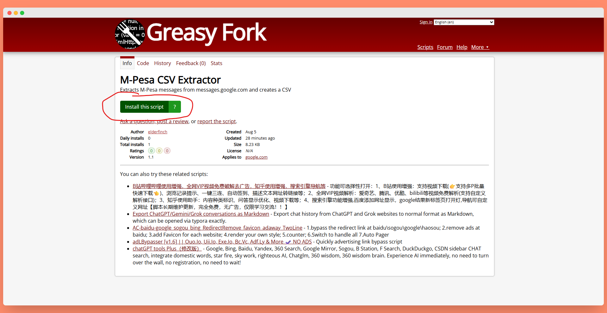
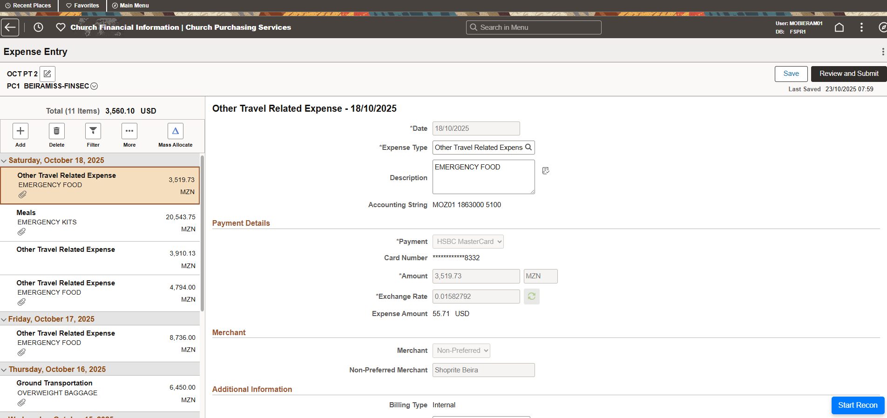

# Financial Secretary Helper Scripts

Hehehe… so you found the secret scripts page. Careful now — these little helpers are highly experimental, dangerously efficient, and known to cause sudden bursts of free time, reduced paperwork stress, and suspiciously accurate reports. Use at your own risk… productivity levels may rise, and you might just finish your work before lunch.

These scripts were 99% written by ChatGPT or Gemini. I did some minor editing and tweaking, but I did not write the code. So if you run into bugs, blame ChatGPT not me. Just kidding. 

## Installing Tampermonkey

To use the scripts, you need to install a Google Chrome extension called Tampermonkey. What is Tampermonkey you ask? It is a Chrome extension that let's you run a bunch of baby chrome extensions. So instead of installing 17 different Chrome extensions, you can install one and then use as many scripts as you'd like. Pretty neat, huh? To install it click here (for Chrome):

https://chromewebstore.google.com/detail/tampermonkey/dhdgffkkebhmkfjojejmpbldmpobfkfo?pli=1

*For other browsers, click here (https://www.tampermonkey.net/index.php)*

*For what it's worth. I highly reccomend installing the adblocker [Ublock Origin Lite](https://chromewebstore.google.com/detail/uBlock%20Origin%20Lite/ddkjiahejlhfcafbddmgiahcphecmpfh?hl=en), which will make your Tampermonkey experience more enjoyable.*

## Installing User Scripts

The easiest way to install the user scripts is to go to Elder Finch's profile on a website called Greasy Fork. Greasy Fork is a website that hosts Tampermonkey scripts. 

[Click here to see Elder Finch's profile](https://greasyfork.org/en/users/1500121-elderfinch)

From there, you should be able to see all the available scripts. 

To install a script, simply click the script link and click "Install This Script"

Screenshot

Then ignore the scary warning and click "Install".

The script should now be installed. Repeat this process for all the scripts you wish to install.

## Using the Scripts

Auto Card Recon

First install Tampermonkey using the steps above. Then download the [Auto Card Recon Script](https://greasyfork.org/en/scripts/553490-auto-card-recon).

## 1. How to Name Your PDFs

The script reads the PDF filename to work. You must use this format:

`VALUE CURRENCY - PLACE - LINE ITEM.pdf`

* The **Value & Currency** must be first (e.g., `123.45 MZN` or `50 MZN`).
* You need at least **two dashes** (`-`) as separators.
* The text after the **last dash** becomes the description.

| Filename | Value | Line Item |
| :--- | :--- | :--- |
| `123.45 MZN - Vodacom - AIRTIME.pdf` | `123.45 MZN` | `AIRTIME` |
| `5889.10 MZN - Matchedje - DIESEL FUEL.pdf` | `5889.10 MZN` | `DIESEL FUEL` |
| `250 ZAR - Nandos - Team Lunch - MISSIONARY TRAVEL.pdf` | `250 ZAR` | `MISSIONARY TRAVEL` |
| `100 MZN - Shoprite.pdf` | **Invalid** | (Needs a second dash) |

---

## 2. How to Run the Script

0. **Open** to the main recon page:

1.  **Start:** On the main recon page, click the blue **"Start Recon"** button (bottom-right) and select **ALL** your PDF receipts.
2.  **Correct (If Needed):** If any filenames are invalid, a pop-up will appear. Manually enter the `Value` and `Line Item` for each bad file and click "Submit."
3.  **Hands Off:** **Do not use your mouse or keyboard.** The script will now:
    * Find the matching transaction.
    * Fill in the main **Line Item** description.
    * Click "Attach Receipt."
    * Click "Add Attachment."
    * Upload the correct PDF.
    * Fill in the attachment's **Line Item** description.
    * Save the attachment and wait 7 seconds before starting the next receipt.

While the script is uploading the reciepts, feel free to open another window and work on other tasks. It takes around 30 seconds - 1 minute for each receipt.
4. Fill in the accounting for each receipt & submit. 
   * Use the Mass Allocation tool or click each receipt and categorize the transaction with the correct account.
   * Submit and confirm your submission. 

---

## 3. What to Expect

The script is **intentionally slow** to prevent the system from glitching. If a PDF has no matching transaction, it will be skipped. If the script stops, just refresh the page and run it again with the remaining receipts. If it starts glitching, close or refresh the page. 

  

  
Copy Ref-Inv + Payee Link (Vendor Payments Submit)  

  

**Script runs on:** [https://imos.churchofjesuschrist.org](https://imos.churchofjesuschrist.org) (Payments Submit page)

This script provides two main functions:

1. **Copy Reference–Invoice for Receipts**

   * When saving a PDF receipt of an IMOS bank transfer in our files, we name the file using the IMOS Reference Number and the Invoice Number (e.g., `1VA0XXXX - INVXXXX`).
   * The script adds a monkey 🐒 button in the bottom-right corner of the "submit payments" page.
   * Clicking this button adds a new column of **Copy Ref – Inv** buttons to the.
   * When you click one of these, the script copies the reference–invoice string to your clipboard.
   * You can then paste it as the file name when saving the receipt.

2. **Quick Payee Link**

   * The script also makes the vendor name clickable.
   * Clicking it takes you directly to the vendor’s recent payments page, saving you the step of searching manually.

  

  

  
Copy Invoice File Name (Vendor Page)  

  

**Script runs on:** [https://imos.churchofjesuschrist.org](https://imos.churchofjesuschrist.org) (Vendor Summary page)

This script works almost the same way as the Payments Submit version but on a Vendor page.

* When you click the monkey 🐒 button in the bottom-right corner, a new column of **Copy Ref – Inv** buttons appears.
* Clicking one copies the reference–invoice string to your clipboard.
* You can then paste it as the PDF file name when saving receipts, instead of manually copying each one.

  

M-Pesa CSV Extractor (Google Messages)

Script runs on: https://messages.google.com/web

This script runs on [https://messages.google.com/web](https://messages.google.com/web).

When doing an M-PESA recon, you need details from your SMS messages: the M-PESA code, transaction amount, date, and fee. This script automates that process. It scans your message history and extracts all transactions, including payments, withdrawals, and POS purchases.

Here’s how it works:

1. Open your messages, and you’ll see a monkey 🐒 button in the bottom-right corner.
2. Click the button and select the date from which you want to start scraping M-PESA transactions.
3. Before running the script, scroll through your messages so all of them are loaded and visible on the page.
4. Click Extract. The script will generate and download a CSV containing the phone number, M-PESA code, amount, and fee.

Next, open your Google Sheet with the M-PESA form responses:

* Insert a column next to the Cost column.
* Paste in the costs generated by the script.
* Reorder the Google Form responses to align with the extracted transactions and identify any missing entries.
* Once everything is matched, you can paste in the fees and M-PESA codes.

